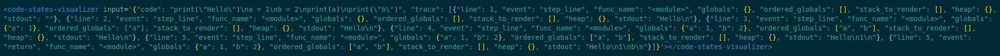
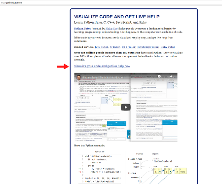
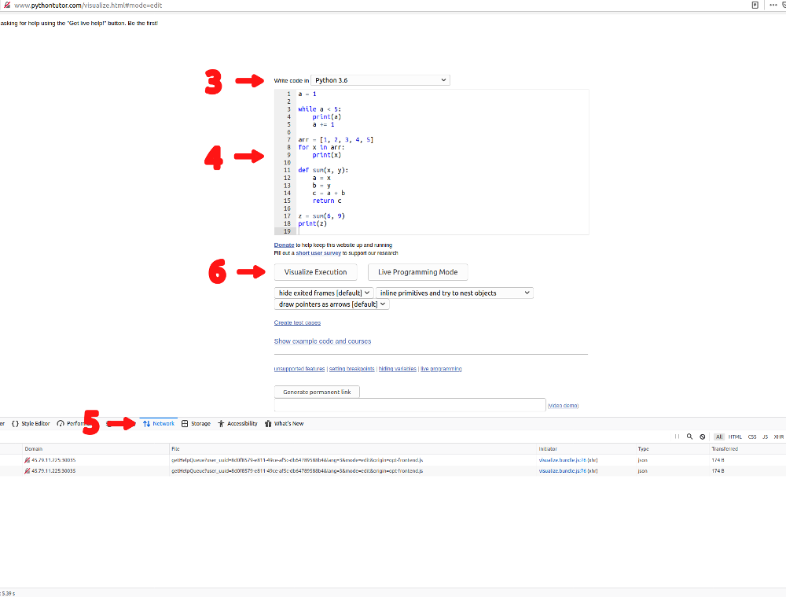
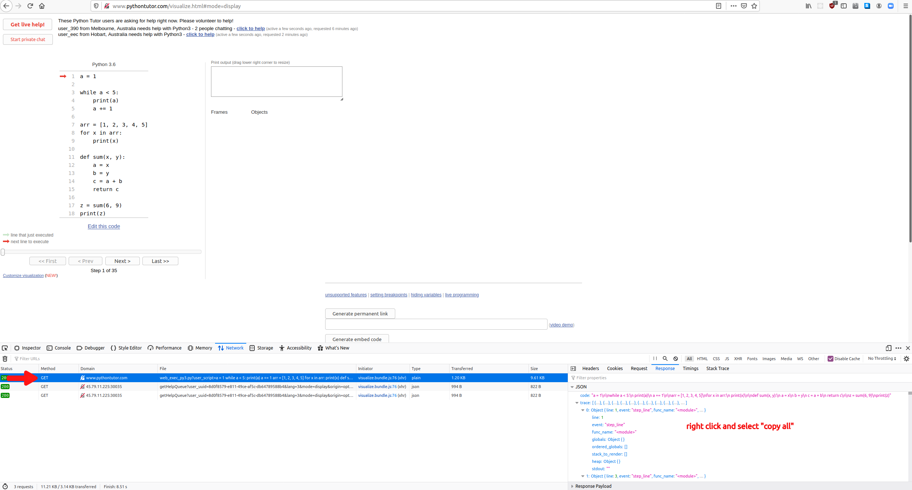

# Code States Visualizer guide

## Adding a Code States Visualizer in a markdown-file

Simply write the tag `<code-states-visualizer input='ADD JSON HERE'></code-states-visualizer>`

Note, that since the input json contains double quotes, we recommend using single quotes around the input. This way there's no need to escape any double quotes in the input json. For this reason, we also recommend using double quotes in your python example code, because otherwise you need to escape every single quote in the input you generate.

Here's an example of a Code States Visualizer in a markdown-file:

## How to generate the input json

1. Go over to http://www.pythontutor.com/
2. Click the link labeled "Visualize your code and get live help now"

3. Select Python 3.6 from the dropdown menu.
4. Write your example code in the field below the dropdown menu. **Note** that if your code contains quotes, we recommend using double quotes. If you use single quotes, you need to escape all of them in the json when adding the input to Code State Visualizer's markdown.
5. Open your browser's Network Monitor.
6. Click the button "Visualize execution" below the field where you wrote your code.

7. Select the request with the domain "www.pythontutor.com".
8. Go to the request's Response-tab.
9. Right click the json and select copy all.

10. Paste the json to the input-part of the tag `code-states-visualizer input=''>` in your markdown-file.
