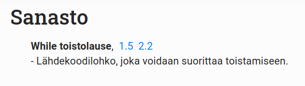
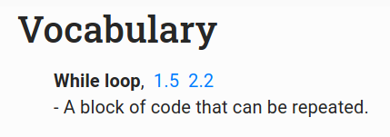

## Sanasto-sivu

Sanaston tarkoituksena on tarjota opiskelijoille nopea pääsy konsepteihin, joita he kohtaavat materiaalissa. Jokaisen konseptin kohdalla on linkit niiden sijainteihin materiaalissa.

Jos konseptille on määritelty kuvaus, se lukee sen alapuolella sanastossa.

Tässä esimerkki Sanastosta:

## Konseptien lisääminen sanastoon

Sanasto löytää automaattisesti kaikki sanaston konseptit kurssimateriaalin markdown-tiedostoista, ja luo löydetyistä konsepteista listan.

Konseptin rakenne markdown-tiedostoissa on seuraava:

`<vocabulary-word name="Example name"></vocabulary-word>`

tai

`<vocabulary-word name="Example name" description="Example description"></vocabulary-word>`

riippuen siitä, haluaako sanalle kuvauksen.

**name**-kenttä on pakollinen, johon kirjoitetaan sanan nimi.

**description**-kenttä on vapaaehtoinen, johon voi kirjoittaa kuvauksen sanasta.

`vocabulary-word`-tagi kannattaa lisätä markdown-tiedostoon juuri ennen konseptin esittelyä. Tällöin Sanasto-sivun linkki materiaaliin vierittää sivun oikeaan kohtaan.

## Vocabulary-page

The purpose of the vocabulary is to offer students fast access to consepts they come across in the materials. Every consept in the vocabulary has a link to the part of the material where the consept was introduced.

If a consept has a description, it is shown below the consept in the vocabulary.

Here's an example of the Vocabulary:

## Adding consepts to the vocabulary

The vocabulary automatically finds all consepts in the markdown-files of the course material, and creates a list of the consepts.

A consept is defined in a markdown-file as follows:

`<vocabulary-word name="Example name"></vocabulary-word>`

or

`<vocabulary-word name="Example name" description="Example description"></vocabulary-word>`

depending on whether a description is defined or not.

**name**-field is required, which is the name of the consept.

**description**-field is optional, where a description of the consept can be added.

The tag `vocabulary-word` should be added in the material right before the consept is introduced. Thus, the link in the Vocabulary-page scrolls the material to the correct position.

